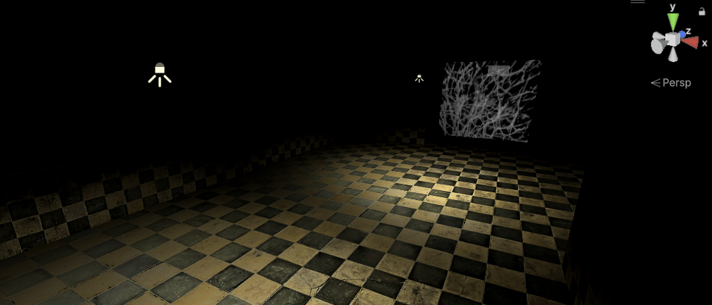

[![Contributors][contributors-shield]][contributors-url]
[![Forks][forks-shield]][forks-url]
[![Stargazers][stars-shield]][stars-url]
[![Issues][issues-shield]][issues-url]
[![Unlicense License][license-shield]][license-url]
[![LinkedIn][linkedin-shield]][linkedin-url]

  <h1>Unity Horror Game (Beginner Series)</h1>
  
  

    A survival horror prototype built using Unity 6, focusing on atmosphere, interactive triggers, and classic jump-scare mechanics.
  
 

  
  
  
    
    

  <a href="#about-the-project"><strong>Explore the docs »</strong></a>

  
Table of Contents

  <ol>
    <li><a href="#about-the-project">About The Project</a></li>
    <li><a href="#built-with">Built With</a></li>
    <li><a href="#file-structure">File Structure</a></li>
    <li><a href="#getting-started">Getting Started</a></li>
    <li><a href="#usage">Usage & Testing</a></li>
    <li><a href="#roadmap">Roadmap</a></li>
    <li><a href="#challenges">Challenges</a></li>
  </ol>

<h2 id="about-the-project">About The Project</h2>

    This project is a step-by-step implementation of a first-person horror experience. Following the <strong>Jimmy Vegas</strong> tutorial series, I focused on creating a "sequence of events" logic—where picking up an item (the candle) triggers environmental changes and unlocks further progression (the gun pickup).

Key features include:

<ul>
    <li><strong>Interactive Item Swapping:</strong> Automatically swapping between a candle and a gun based on player progress.</li>
    <li><strong>Sequence Triggers:</strong> A door-slam jump-scare that dynamically enables object pickups in the scene.</li>
    <li><strong>Atmospheric Design:</strong> Using tiled materials and dim URP lighting to create a sense of dread.</li>
</ul>

<a href="#readme-top">↑ Back to Top</a>

<h2 id="built-with">Built With</h2>
<ul>
    <li><strong>Unity 6:</strong> Utilizing the Universal Render Pipeline (URP) for modern horror aesthetics.</li>
    <li><strong>C# Scripting:</strong> Custom sequencing scripts to handle animation triggers and inventory state.</li>
    <li><strong>Legacy Input:</strong> Simple and effective control mapping for movement and interaction.</li>
</ul>

<a href="#readme-top">↑ Back to Top</a>

<h2 id="file-structure">File Structure</h2>
<pre>Horror-Game-Prototype/
├── Assets/
│   ├── Animations/                 # Door slam and jump-scare clips
│   │   └── DoorSlam.anim
│   ├── Materials/                  # URP Materials (Tiling: 2x2 for floors)
│   │   ├── Floor_Mat.mat
│   │   └── Wall_Mat.mat
│   ├── Prefabs/                    # Interactive game objects
│   │   ├── Player.prefab           # Includes CameraHolder and Hand slots
│   │   ├── Candle_Static.prefab    # Table version
│   │   └── Gun_Pickup.prefab       # Initially disabled in Inspector
│   ├── Scenes/
│   │   └── HorrorMain.unity
│   ├── Scripts/
│   │   ├── MouseLook.cs            # Camera clamping logic
│   │   ├── PlayerMovement.cs       # FPS movement & jumping
│   │   └── DoorJumpScare.cs        # Logic: Trigger -> Animation -> Enable Gun
│   ├── Textures/                   # Raw image files (e.g., .jpg, .png)
│   │   ├── floor_texture.jpg
│   │   └── wall_texture.jpg
│   └── Settings/                   # URP Pipeline assets
├── ProjectSettings/                # Unity project configuration
└── README.md                       # Documentation   
</pre>

<a href="#readme-top">↑ Back to Top</a>

<h2 id="getting-started">Getting Started</h2>
<h3>Installation</h3>
<ol>
    <li>Clone the repository.</li>
    <li>Open the project in <strong>Unity 6</strong>.</li>
    <li>Ensure the <strong>Textures</strong> folder contains the floor and wall images.</li>
    <li>Open the main scene and ensure the <strong>GunPickup</strong> object is disabled by default in the Inspector.</li>
</ol>

<a href="#readme-top">↑ Back to Top</a>

<h2 id="usage">Usage & Testing</h2>
<h3>🎮 Gameplay Flow</h3>
<ul>
  <li><strong>Step 1:</strong> Pick up the Candle from the table.</li>
  <li><strong>Step 2:</strong> Walk through the hallway trigger. The door will slam, and the Gun will appear on the table.</li>
  <li><strong>Step 3:</strong> Pick up the Gun; the candle will automatically be placed back on the table.</li>
</ul>

Watch the sample gameplay at my linkedIn post here: <a href="">Horror Game Prototype</a>

<h3>Testing Notes</h3>
<ul>
    <li>Check that <code>gunPickup.SetActive(true)</code> is called exactly when the door animation plays.</li>
    <li>Verify that the <code>LayerMask</code> on the floor prevents the player from falling through the world.</li>
</ul>

<a href="#readme-top">↑ Back to Top</a>

<h2 id="roadmap">Roadmap</h2>
<ul>
    <li>[x] Texture and Material setup</li>
    <li>[x] Basic First-Person movement</li>
    <li>[x] Interaction Sequencing (Candle/Gun swap)</li>
    <li>[x] Jump-scare event triggers</li>
    <li>[ ] Implementation of Gun firing mechanics (Sound/Flash)</li>
    <li>[ ] Enemy AI (Zombies/Stalkers)</li>
</ul>

<a href="#readme-top">↑ Back to Top</a>

<h2 id="challenges">Challenges</h2>
<table width="100%">
    <thead>
        <tr>
            <th>Challenge</th>
            <th>Solution</th>
        </tr>
    </thead>
    <tbody>
        <tr>
            <td><strong>Texture Stretching</strong></td>
            <td>Applied 2x2 Tiling in the Material Inspector to maintain realistic proportions on the floor.</td>
        </tr>
        <tr>
            <td><strong>Sequence Logic</strong></td>
            <td>Used <code>[SerializeField]</code> to link the Gun object to the Door Scare script, ensuring the gun only appears after the scare event.</td>
        </tr>
        <tr>
            <td><strong>Lighting Dimness</strong></td>
            <td>Unity 6 URP requires higher HDR intensity; adjusted light ranges and intensities to 0.5 for a "dull" atmosphere.</td>
        </tr>
    </tbody>
</table>

<a href="#readme-top">↑ Back to Top</a>

<h2 id="acknowledgements">🙏 Acknowledgements</h2>

Special thanks to <a href="https://www.youtube.com/@JimmyVegasUnity"><strong>Jimmy Vegas</strong></a> for the legendary Unity tutorials that continue to help beginners enter game development.

View the tutorial playlist here: <a href="https://www.youtube.com/playlist?list=PLZ1b66Z1KFKiBTivzyPkktSPskftCUFeL">HOW TO MAKE A SURVIVAL HORROR GAME IN UNITY</a>

This repository is intended for learning and portfolio showcase purposes only.

<a href="#readme-top">↑ Back to Top</a>

[contributors-shield]: https://img.shields.io/github/contributors/ShenLoong99/horror-game-tutorial-test.svg?style=for-the-badge
[contributors-url]: https://github.com/ShenLoong99/horror-game-tutorial-test/graphs/contributors
[forks-shield]: https://img.shields.io/github/forks/ShenLoong99/horror-game-tutorial-test.svg?style=for-the-badge
[forks-url]: https://github.com/ShenLoong99/horror-game-tutorial-test/network/members
[stars-shield]: https://img.shields.io/github/stars/ShenLoong99/horror-game-tutorial-test.svg?style=for-the-badge
[stars-url]: https://github.com/ShenLoong99/horror-game-tutorial-test/stargazers
[issues-shield]: https://img.shields.io/github/issues/ShenLoong99/horror-game-tutorial-test.svg?style=for-the-badge
[issues-url]: https://github.com/ShenLoong99/horror-game-tutorial-test/issues
[license-shield]: https://img.shields.io/github/license/ShenLoong99/horror-game-tutorial-test.svg?style=for-the-badge
[license-url]: https://github.com/ShenLoong99/horror-game-tutorial-test/blob/master/LICENSE.txt
[linkedin-shield]: https://img.shields.io/badge/-LinkedIn-black.svg?style=for-the-badge&logo=linkedin&colorB=555
[linkedin-url]: https://linkedin.com/in/si-kai-tan